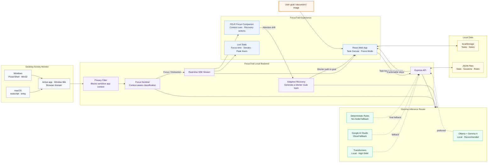
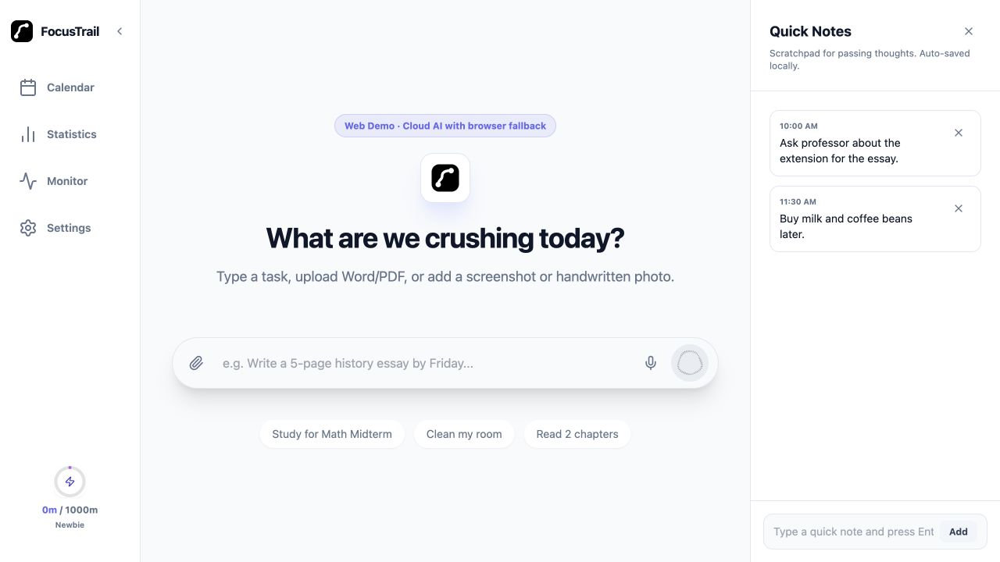
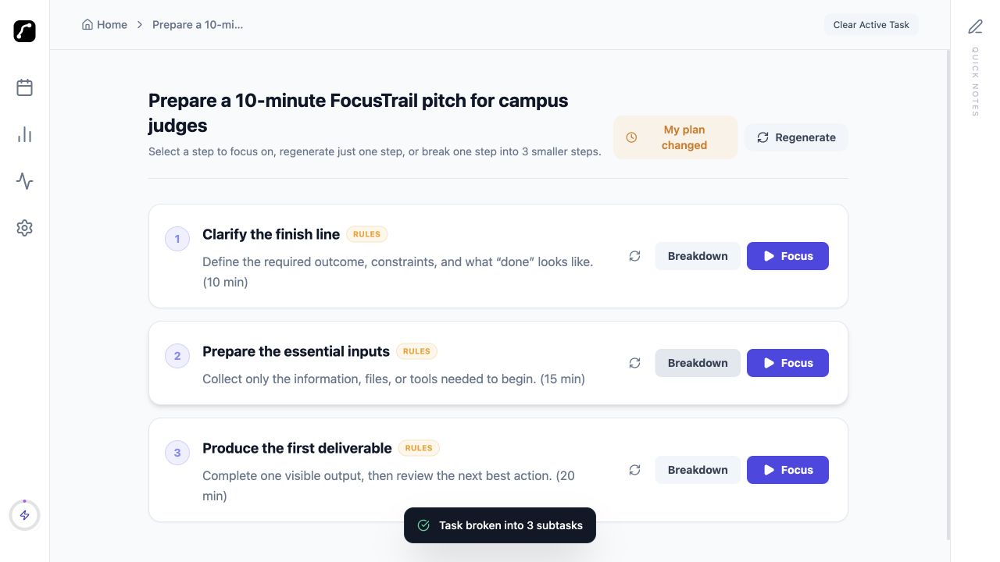
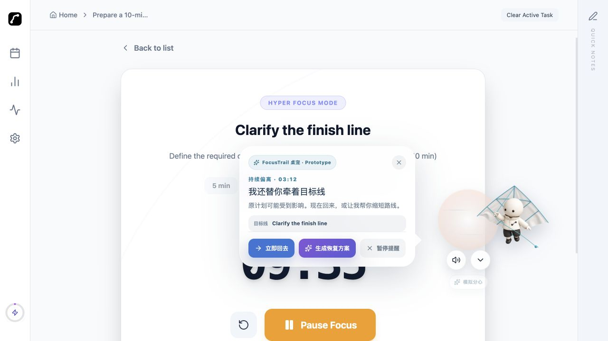

<div align="center">

# FocusTrail

**Local-first Gemma 4 learning coach for deep work.**

Break any task into steps → monitor your real-time activity with context-sensitive Gemma classification → see exactly where your time goes.


</div>

---

## What it does

| Feature | Description |
|---|---|
| **Local Gemma Task Breakdown** | Type a goal or upload Word/PDF, screenshots, or handwritten photos; Gemma 4 breaks it into subtasks, each drill-downable into 3 more |
| **Context-sensitive Focus Sentinel** | macOS/Windows agent reads the active window every 15s; Gemma 4 classifies it as focus or distraction relative to your active task — the same YouTube video can be focus or distraction depending on what you're working on |
| **PrivacySurface Badge** | Live display of inference provider, cloud-call counter, and local/private status. Sensitive apps (Messages, 1Password, banking) are privacy-filtered before any model call |
| **Live Stats** | Focus minutes, distraction time, streaks, and peak hours — updated instantly via SSE |
| **Adaptive Recovery** | When a plan changes or attention drifts, generate a shorter route back to the current goal instead of restarting from zero |
| **FELR Focus Companion** | A draggable Turning Kite desktop companion surfaces context-sensitive focus/distraction messages and recovery actions without covering the task canvas |
| **Classification Rules** | Edit which apps and domains count as focus or distraction from the Settings panel |
| **Quick Notes** | Persistent scratchpad beside the task canvas |
| **Calendar View** | Schedule tasks and browse history by date |

## How FocusTrail works



### Screenshots

**Home**
<p align="center">
  
  <br/><sub>Start from one goal, a document, screenshot, or handwritten photo</sub>
</p>

**Local Gemma Task Breakdown**
<p align="center">
  
  <br/><sub>Turn a broad goal into three actionable steps, then focus or break down any step again</sub>
</p>

**FELR Turning Kite Focus Companion**
<p align="center">
  
  <br/><sub>Draggable always-on-top companion with focus cues, simulated distraction alerts, and one-click recovery actions</sub>
</p>

**Focus Mode**
<p align="center">
  
  <br/><sub>Isolated single-task execution view with timer and progress</sub>
</p>

**Activity Monitor & Stats**
<p align="center">
  
  
  <br/><sub>Real-time window classification (left) · Daily focus score, streak, and peak hours (right)</sub>
</p>

**Rewards**
<p align="center">
  
  <br/><sub>Game-style level progression tied to cumulative focus minutes</sub>
</p>

---

## Quick start

### Prerequisites

- Node.js 18+
- macOS or Windows (for the activity monitor; the rest works on any OS)
- **Recommended — Ollama** (local, runs on 8GB RAM): install from [ollama.com](https://ollama.com), then `ollama pull gemma4:e2b`
- **Alternative — Google AI Studio API key** (cloud dev fallback): set `GOOGLE_API_KEY` in `.env`
- Optional: Python 3.10+ and a local `google/gemma-4-E2B-it` model for direct Transformers inference (requires ~10GB RAM)

### 1. Clone and install

```bash
git clone https://github.com/lalalastella/FocusTrail.git
cd FocusTrail
npm install
```

### 2. Set up Gemma inference

**Option A — Ollama (recommended, works on 8 GB RAM):**

```bash
# Install Ollama from https://ollama.com, then:
ollama pull gemma4:e2b
```

The server detects Ollama automatically on startup and uses it for both task breakdown and Focus Sentinel classification.

**Option B — Google AI Studio API (cloud dev fallback):**

Get a free API key from [aistudio.google.com](https://aistudio.google.com) and set it in `.env` (see step 3). The app will use this when Ollama is unavailable.

**Option C — Local Transformers (requires ~10 GB RAM):**

```bash
python3 -m venv .venv
source .venv/bin/activate
pip install -r requirements.txt
npm run download:gemma   # requires HF_TOKEN in .env
```

### 3. Configure environment

```bash
cp .env.example .env
```

Open `.env` and configure your inference path:

```env
PORT=8787

# Option A: Ollama (local, recommended)
GEMMA_OLLAMA_URL=http://localhost:11434
GEMMA_OLLAMA_MODEL=gemma4:e2b

# Option B: Google AI Studio API (cloud dev fallback)
# GOOGLE_API_KEY=your_key_here
# GOOGLE_GEMMA_MODEL=gemma-4-26b-a4b-it

# Option C: Local Transformers (high RAM required)
GEMMA_MODEL_ID=google/gemma-4-E2B-it
GEMMA_MODEL_DIR=./models/gemma-4-E2B-it
```

Inference priority at runtime: **Ollama → Google AI Studio API → local Transformers → deterministic rules fallback**.

The `PrivacySurface` badge in the Monitor panel shows the active provider, whether inference is local, and a live cloud-call counter. In a local-only setup (Ollama), the counter stays at 0.

Upload intake supports text, Word/Office documents, PDFs, and native image inputs for screenshots or handwritten photos (`PNG`, `JPG/JPEG`, `WebP`, `BMP`, `GIF`, `TIFF`). Image uploads are decoded locally and passed to Gemma as pixels rather than through an OCR-only preprocessing step.

### 4. Start the backend

```bash
npm run server
```

### 5. Start the frontend

In a second terminal:

```bash
npm run dev
```

### 6. Open the app

Go to `http://localhost:5173`, open the **Monitor** panel, and toggle **Active Monitor** on. The desktop agent starts automatically.

---

## Web Demo deployment

Live Web Demo: **https://focus-trail.vercel.app/**

ADTI attention-personality experience:

- China: **https://focustrail-adti.coze.site/**
- Overseas: **https://focustrail-adti.jyxsju.chatgpt.site/**

The public Web Demo deploys the existing Express API as a Vercel Function. In
production, when `VITE_API_BASE` is not configured, the frontend calls the
same-origin `/api` routes. Configure `GOOGLE_API_KEY` in Vercel to enable
model-backed generation. If the cloud API is unavailable, task breakdown and
adaptive recovery fall back to deterministic browser logic so the demo remains
usable.

```bash
VITE_WEB_DEMO=true npm run build
npm run preview
```

`vercel.json` contains the Vite build and SPA rewrite configuration for Vercel.
Optionally set `VITE_API_BASE` to use a separately hosted backend. Never expose
model credentials through a `VITE_` variable; server-side credentials belong in
Vercel Environment Variables. Focus monitoring remains a Desktop-only capability
because a public browser cannot read activity from other applications.

---

## Activity monitor (macOS and Windows)

Toggling **Active Monitor** on in the sidebar:

1. Creates a backend session
2. Automatically launches `scripts/desktop-monitor.js`
3. Streams classified events to the timeline in real time

The agent uses native OS tooling with no extra npm packages: `osascript`/`ioreg` on macOS, and PowerShell + Win32 APIs on Windows. It detects the active app, window title, and browser domain where available. By default it samples every 2 seconds, reports a window after 2 seconds of continuous stay, and refreshes long-running activity in 5-second chunks; idle time is capped at 5 minutes so stepping away doesn't inflate focus scores.

**Status indicators:**

| Status | Meaning |
|---|---|
| `Tracking` | Session active, desktop agent running |
| `Session active · agent offline` | Session exists, agent not detected |
| `Needs attention` | Desktop access, PowerShell, or platform support needs attention |
| `Off` | No active session |

> On macOS, grant Accessibility permission to the app that launched the backend — Terminal, VS Code, Cursor, etc. On Windows, make sure the backend is running in your interactive desktop session with Windows PowerShell available.

**Known monitor limits:**
- Browser domain detection is exact for macOS Chrome/Safari; Windows infers domains from visible URLs or common browser title hints, so it can be less precise
- Gemma semantic classification requires Ollama or a Google API key; without either, classification falls back to rule-based logic
- Single-user, single-machine, local use only
- The 2-second reporting threshold is low by design for testing; consider 60s+ for production

The standalone agent is also available for debugging:

```bash
npm run monitor-agent
```

Run a one-shot desktop access check without starting a monitor session:

```bash
npm run monitor-agent -- --probe
```

> Do not run both the UI-managed and standalone agents at the same time — events will be duplicated.

---

## Classification rules

Activity is matched by app name and domain:

- **Focus** — VS Code, Cursor, Xcode, Terminal, Word, Excel, Notion, Figma, GitHub, StackOverflow, …
- **Distraction** — Reddit, Instagram, TikTok, Twitter/X, Netflix, Twitch, YouTube (unless task context matches), …

Rules are editable in **Settings → Monitor Classification** and persisted in `server/data/classification.json`.

---

## API reference

The backend runs on `http://localhost:8787`.

<details>
<summary>Expand full API list</summary>

| Method | Path | Description |
|---|---|---|
| `POST` | `/api/breakdown` | Local Gemma task breakdown with deterministic fallback |
| `GET` | `/api/provider/health` | Local Gemma provider status and cloud-call counter |
| `GET` | `/api/monitor/provider/health` | Monitor inference provider status (Ollama/API/local) |
| `GET` | `/api/stats` | Daily focus stats |
| `POST` | `/api/stats/focus-session` | Record a focus session |
| `POST` | `/api/stats/completed-task` | Record a completed task |
| `POST` | `/api/stats/distraction` | Record a distraction event |
| `GET` | `/api/monitor/stream` | SSE stream for real-time events |
| `POST` | `/api/monitor/session/start` | Start a monitor session |
| `POST` | `/api/monitor/session/end` | End a monitor session |
| `GET` | `/api/monitor/session/active` | Get the active session |
| `POST` | `/api/monitor/event` | Receive a classified activity event |
| `GET` | `/api/monitor/events/:sessionId` | List events for a session |
| `GET` | `/api/monitor/agent/status` | Desktop agent status |
| `GET` | `/api/monitor/agent/probe` | One-shot desktop access check |
| `POST` | `/api/monitor/agent/start` | Start the desktop agent |
| `POST` | `/api/monitor/agent/stop` | Stop the desktop agent |
| `GET` | `/api/monitor/privacy/config` | Get privacy filter config |
| `POST` | `/api/monitor/privacy/config` | Update privacy filter config |
| `GET` | `/api/monitor/classification/config` | Get focus/distraction rules |
| `POST` | `/api/monitor/classification/config` | Update focus/distraction rules |
| `POST` | `/api/monitor/classification/config/reset` | Reset rules to defaults |

</details>

---

## Project structure

```
FocusTrail/
├── scripts/
│   └── desktop-monitor.js          # macOS/Windows window monitor agent
├── server/
│   ├── index.js                    # Express entry point
│   ├── statsStore.js               # Stats helpers and computeStats()
│   └── monitor/
│       ├── routes.js               # /api/monitor endpoints
│       ├── agent.js                # Agent process lifecycle
│       ├── store.js                # Session/event persistence + crash recovery
│       ├── stream.js               # SSE broadcast
│       ├── classifier.js           # Rule-based focus/distraction classifier
│       ├── classificationConfig.js # Editable classification rules
│       ├── privacy.js              # Privacy filter
│       └── statsBridge.js          # Writes events to stats, broadcasts stats.updated
└── src/
    ├── App.jsx                     # Global state, layout, SSE stats listener
    ├── services/
    │   ├── statsApi.js             # /api/stats fetch wrappers
    │   └── monitorApi.js           # /api/monitor fetch wrappers + SSE
    ├── components/
    │   ├── panels/                 # Monitor, Stats, Calendar, Settings, Notes
    │   ├── views/                  # ViewA (home), ViewB (task), ViewCE (tree), FocusDetail
    │   └── common/                 # Shared UI primitives
    └── utils/
        ├── taskTree.js             # Tree traversal helpers
        └── storage.js              # localStorage loaders
```

---

## Tech stack

- **Frontend** — React 19, Vite 7, Tailwind CSS, Lucide icons
- **Backend** — Node.js, Express, Server-Sent Events
- **AI** — Gemma 4 via Ollama (local, recommended) · Google AI Studio API (cloud dev fallback) · Transformers (direct, high-RAM) · deterministic rules (no-model fallback)
- **Monitor** — macOS `osascript` / `ioreg`, Windows PowerShell / Win32 APIs (no native addons)
- **Storage** — localStorage (tasks/notes), JSON files (stats/sessions)

---

## Contributing

Pull requests are welcome. For significant changes, please open an issue first to discuss what you'd like to change.

1. Fork the repo
2. Create a feature branch: `git checkout -b feat/your-feature`
3. Commit your changes: `git commit -m "feat: add your feature"`
4. Push and open a PR against `main`

---

## License

Apache-2.0 © PST Protocol
